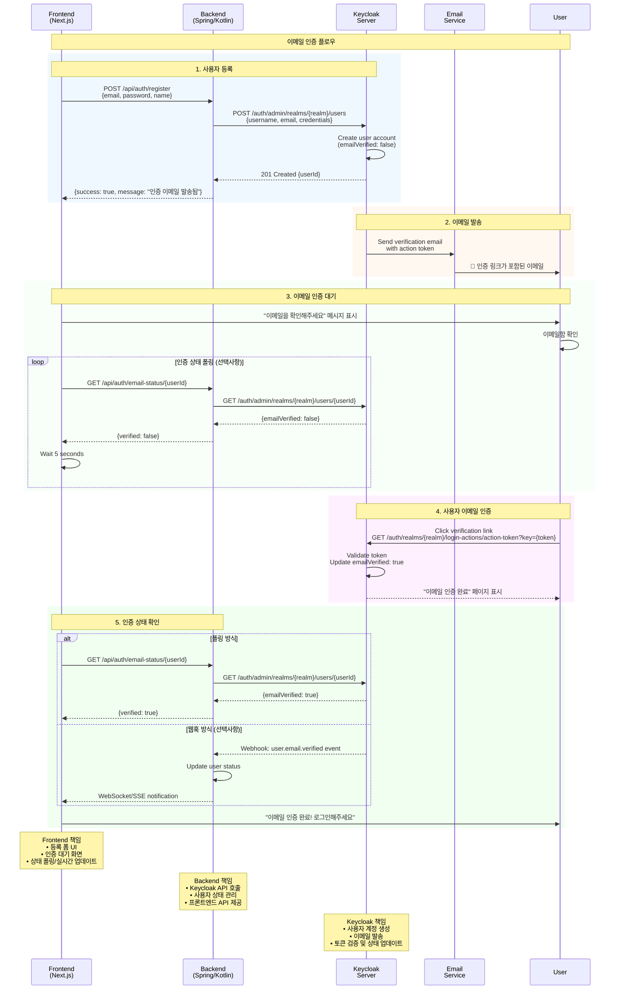

```mermaid
sequenceDiagram
    participant FE as Frontend<br/>(Next.js)
    participant BE as Backend<br/>(Spring/Kotlin)
    participant KC as Keycloak<br/>Server
    participant Email as Email<br/>Service
    participant User as User

    Note over FE,User: 이메일 인증 플로우
    
    rect rgb(240, 248, 255)
    Note over FE,KC: 1. 사용자 등록
    FE->>BE: POST /api/auth/register<br/>{email, password, name}
    BE->>KC: POST /auth/admin/realms/{realm}/users<br/>{username, email, credentials}
    KC->>KC: Create user account<br/>(emailVerified: false)
    KC-->>BE: 201 Created {userId}
    BE-->>FE: {success: true, message: "인증 이메일 발송됨"}
    end
    
    rect rgb(255, 248, 240)
    Note over KC,User: 2. 이메일 발송
    KC->>Email: Send verification email<br/>with action token
    Email->>User: 📧 인증 링크가 포함된 이메일
    end
    
    rect rgb(248, 255, 248)
    Note over FE,User: 3. 이메일 인증 대기
    FE->>User: "이메일을 확인해주세요" 메시지 표시
    User->>User: 이메일함 확인
    
    loop 인증 상태 폴링 (선택사항)
        FE->>BE: GET /api/auth/email-status/{userId}
        BE->>KC: GET /auth/admin/realms/{realm}/users/{userId}
        KC-->>BE: {emailVerified: false}
        BE-->>FE: {verified: false}
        FE->>FE: Wait 5 seconds
    end
    end
    
    rect rgb(255, 240, 255)
    Note over User,KC: 4. 사용자 이메일 인증
    User->>KC: Click verification link<br/>GET /auth/realms/{realm}/login-actions/action-token?key={token}
    KC->>KC: Validate token<br/>Update emailVerified: true
    KC-->>User: "이메일 인증 완료" 페이지 표시
    end
    
    rect rgb(240, 255, 240)
    Note over FE,BE: 5. 인증 상태 확인
    alt 폴링 방식
        FE->>BE: GET /api/auth/email-status/{userId}
        BE->>KC: GET /auth/admin/realms/{realm}/users/{userId}
        KC-->>BE: {emailVerified: true}
        BE-->>FE: {verified: true}
    else 웹훅 방식 (선택사항)
        KC-->>BE: Webhook: user.email.verified event
        BE->>BE: Update user status
        BE-->>FE: WebSocket/SSE notification
    end
    
    FE->>User: "이메일 인증 완료! 로그인해주세요"
    end

    Note over FE: Frontend 책임<br/>• 등록 폼 UI<br/>• 인증 대기 화면<br/>• 상태 폴링/실시간 업데이트
    Note over BE: Backend 책임<br/>• Keycloak API 호출<br/>• 사용자 상태 관리<br/>• 프론트엔드 API 제공
    Note over KC: Keycloak 책임<br/>• 사용자 계정 생성<br/>• 이메일 발송<br/>• 토큰 검증 및 상태 업데이트
```

# 회원 가입 시 이메일 인증 미완료 임시 데이터 처리