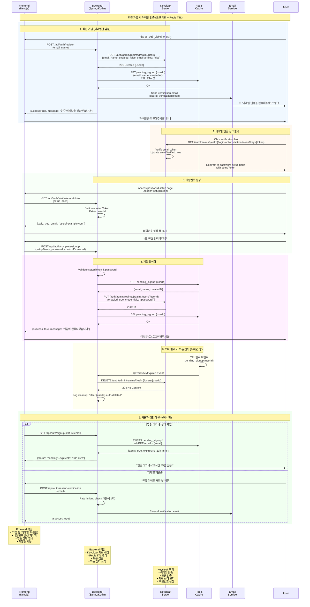
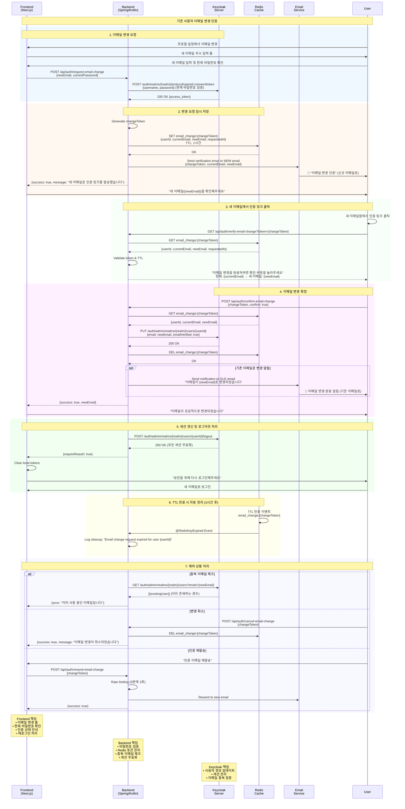

# 회원 가입 시 이메일 인증 (Redis TTL + 토큰 기반)

```mermaid
sequenceDiagram
    participant FE as Frontend<br/>(Next.js)
    participant BE as Backend<br/>(Spring/Kotlin)
    participant KC as Keycloak<br/>Server
    participant Redis as Redis<br/>Cache
    participant Email as Email<br/>Service
    participant User as User

    Note over FE,User: 회원 가입 시 이메일 인증 (토큰 기반 + Redis TTL)

    rect rgb(240, 248, 255)
    Note over FE,KC: 1. 회원 가입 (이메일만 받음)
    User->>FE: 가입 폼 작성 (이메일, 이름만)
    FE->>BE: POST /api/auth/register<br/>{email, name}
    
    BE->>KC: POST /auth/admin/realms/{realm}/users<br/>{email, name, enabled: false, emailVerified: false}
    KC-->>BE: 201 Created {userId}
    
    BE->>Redis: SET pending_signup:{userId}<br/>{email, name, createdAt}<br/>TTL: 24시간
    Redis-->>BE: OK
    
    BE->>Email: Send verification email<br/>{userId, verificationToken}
    Email->>User: 📧 "이메일 인증을 완료해주세요" 링크
    
    BE-->>FE: {success: true, message: "인증 이메일을 발송했습니다"}
    FE->>User: "이메일을 확인해주세요" 안내
    end

    rect rgb(255, 248, 240)
    Note over User,KC: 2. 이메일 인증 링크 클릭
    User->>KC: Click verification link<br/>GET /auth/realms/{realm}/login-actions/action-token?key={token}
    KC->>KC: Verify email token<br/>Update emailVerified: true
    KC-->>User: Redirect to password setup page<br/>with setupToken
    end

    rect rgb(248, 255, 248)
    Note over User,BE: 3. 비밀번호 설정
    User->>FE: Access password setup page<br/>?token={setupToken}
    FE->>BE: GET /api/auth/verify-setup-token<br/>{setupToken}
    BE->>BE: Validate setupToken<br/>Extract userId
    BE-->>FE: {valid: true, email: "user@example.com"}
    
    FE->>User: 비밀번호 설정 폼 표시
    User->>FE: 비밀번고 입력 및 확인
    FE->>BE: POST /api/auth/complete-signup<br/>{setupToken, password, confirmPassword}
    end

    rect rgb(255, 240, 255)
    Note over BE,Redis: 4. 계정 활성화
    BE->>BE: Validate setupToken & password
    BE->>Redis: GET pending_signup:{userId}
    Redis-->>BE: {email, name, createdAt}
    
    BE->>KC: PUT /auth/admin/realms/{realm}/users/{userId}<br/>{enabled: true, credentials: [{password}]}
    KC-->>BE: 200 OK
    
    BE->>Redis: DEL pending_signup:{userId}
    Redis-->>BE: OK
    
    BE-->>FE: {success: true, message: "가입이 완료되었습니다"}
    FE->>User: "가입 완료! 로그인해주세요"
    end

    rect rgb(255, 255, 240)
    Note over Redis,KC: 5. TTL 만료 시 자동 정리 (24시간 후)
    Redis->>Redis: TTL 만료 이벤트<br/>pending_signup:{userId}
    Redis->>BE: @RedisKeyExpired Event
    BE->>KC: DELETE /auth/admin/realms/{realm}/users/{userId}
    KC-->>BE: 204 No Content
    BE->>BE: Log cleanup: "User {userId} auto-deleted"
    end

    rect rgb(240, 255, 240)
    Note over FE,User: 6. 사용자 경험 개선 (선택사항)
    alt 인증 대기 중 상태 확인
        FE->>BE: GET /api/auth/signup-status/{email}
        BE->>Redis: EXISTS pending_signup:*<br/>WHERE email = {email}
        Redis-->>BE: {exists: true, expiresIn: "23h 45m"}
        BE-->>FE: {status: "pending", expiresIn: "23h 45m"}
        FE->>User: "인증 대기 중 (23시간 45분 남음)"
    else 이메일 재발송
        User->>FE: "인증 이메일 재발송" 버튼
        FE->>BE: POST /api/auth/resend-verification<br/>{email}
        BE->>BE: Rate limiting check (5분에 1회)
        BE->>Email: Resend verification email
        BE-->>FE: {success: true}
    end
    end

    Note over FE: Frontend 책임<br/>• 가입 폼 (이메일, 이름만)<br/>• 비밀번호 설정 페이지<br/>• 인증 상태 안내<br/>• 재발송 기능
    Note over BE: Backend 책임<br/>• Keycloak 계정 생성<br/>• Redis TTL 관리<br/>• 토큰 검증<br/>• 자동 정리 로직
    Note over KC: Keycloak 책임<br/>• 이메일 발송<br/>• 토큰 검증<br/>• 계정 상태 관리<br/>• 비밀번호 설정
```

# 기존 회원 이메일 변경 인증

```mermaid
sequenceDiagram
    participant FE as Frontend<br/>(Next.js)
    participant BE as Backend<br/>(Spring/Kotlin)
    participant KC as Keycloak<br/>Server
    participant Redis as Redis<br/>Cache
    participant Email as Email<br/>Service
    participant User as User

    Note over FE,User: 기존 사용자 이메일 변경 인증

    rect rgb(240, 248, 255)
    Note over FE,KC: 1. 이메일 변경 요청
    User->>FE: 프로필 설정에서 이메일 변경
    FE->>User: 새 이메일 주소 입력 폼
    User->>FE: 새 이메일 입력 및 현재 비밀번호 확인
    
    FE->>BE: POST /api/auth/request-email-change<br/>{newEmail, currentPassword}
    BE->>KC: POST /auth/realms/{realm}/protocol/openid-connect/token<br/>{username, password} (현재 비밀번호 검증)
    KC-->>BE: 200 OK {access_token}
    end

    rect rgb(255, 248, 240)
    Note over BE,Redis: 2. 변경 요청 임시 저장
    BE->>BE: Generate changeToken
    BE->>Redis: SET email_change:{changeToken}<br/>{userId, currentEmail, newEmail, requestedAt}<br/>TTL: 1시간
    Redis-->>BE: OK
    
    BE->>Email: Send verification email to NEW email<br/>{changeToken, currentEmail, newEmail}
    Email->>User: 📧 "이메일 변경 인증" (신규 이메일로)
    
    BE-->>FE: {success: true, message: "새 이메일로 인증 링크를 발송했습니다"}
    FE->>User: "새 이메일({newEmail})을 확인해주세요"
    end

    rect rgb(248, 255, 248)
    Note over User,BE: 3. 새 이메일에서 인증 링크 클릭
    User->>User: 새 이메일함에서 인증 링크 클릭
    User->>BE: GET /api/auth/verify-email-change?token={changeToken}
    
    BE->>Redis: GET email_change:{changeToken}
    Redis-->>BE: {userId, currentEmail, newEmail, requestedAt}
    
    BE->>BE: Validate token & TTL
    BE-->>User: "이메일 변경을 완료하려면 확인 버튼을 눌러주세요"<br/>현재: {currentEmail} → 새 이메일: {newEmail}
    end

    rect rgb(255, 240, 255)
    Note over User,KC: 4. 이메일 변경 확정
    User->>BE: POST /api/auth/confirm-email-change<br/>{changeToken, confirm: true}
    
    BE->>Redis: GET email_change:{changeToken}
    Redis-->>BE: {userId, currentEmail, newEmail}
    
    BE->>KC: PUT /auth/admin/realms/{realm}/users/{userId}<br/>{email: newEmail, emailVerified: true}
    KC-->>BE: 200 OK
    
    BE->>Redis: DEL email_change:{changeToken}
    Redis-->>BE: OK
    
    opt 기존 이메일로 변경 알림
        BE->>Email: Send notification to OLD email<br/>"이메일이 {newEmail}로 변경되었습니다"
        Email->>User: 📧 이메일 변경 완료 알림 (기존 이메일로)
    end
    
    BE-->>FE: {success: true, newEmail}
    FE->>User: "이메일이 성공적으로 변경되었습니다"
    end

    rect rgb(240, 255, 240)
    Note over FE,User: 5. 세션 갱신 및 로그아웃 처리
    BE->>KC: POST /auth/admin/realms/{realm}/users/{userId}/logout
    KC-->>BE: 200 OK (모든 세션 무효화)
    
    BE-->>FE: {requireReauth: true}
    FE->>FE: Clear local tokens
    FE->>User: "보안을 위해 다시 로그인해주세요"
    User->>FE: 새 이메일로 로그인
    end

    rect rgb(255, 255, 240)
    Note over Redis,BE: 6. TTL 만료 시 자동 정리 (1시간 후)
    Redis->>Redis: TTL 만료 이벤트<br/>email_change:{changeToken}
    Redis->>BE: @RedisKeyExpired Event
    BE->>BE: Log cleanup: "Email change request expired for user {userId}"
    end

    rect rgb(248, 248, 255)
    Note over FE,User: 7. 예외 상황 처리
    alt 중복 이메일 체크
        BE->>KC: GET /auth/admin/realms/{realm}/users?email={newEmail}
        KC-->>BE: [{existingUser}] (이미 존재하는 경우)
        BE-->>FE: {error: "이미 사용 중인 이메일입니다"}
    else 변경 취소
        User->>BE: POST /api/auth/cancel-email-change<br/>{changeToken}
        BE->>Redis: DEL email_change:{changeToken}
        BE-->>FE: {success: true, message: "이메일 변경이 취소되었습니다"}
    else 인증 재발송
        User->>FE: "인증 이메일 재발송"
        FE->>BE: POST /api/auth/resend-email-change<br/>{changeToken}
        BE->>BE: Rate limiting (5분에 1회)
        BE->>Email: Resend to new email
        BE-->>FE: {success: true}
    end
    end

    Note over FE: Frontend 책임<br/>• 이메일 변경 폼<br/>• 현재 비밀번호 확인<br/>• 인증 상태 안내<br/>• 재로그인 처리
    Note over BE: Backend 책임<br/>• 비밀번호 검증<br/>• Redis 토큰 관리<br/>• 중복 이메일 체크<br/>• 세션 무효화
    Note over KC: Keycloak 책임<br/>• 사용자 정보 업데이트<br/>• 세션 관리<br/>• 이메일 중복 검증
```