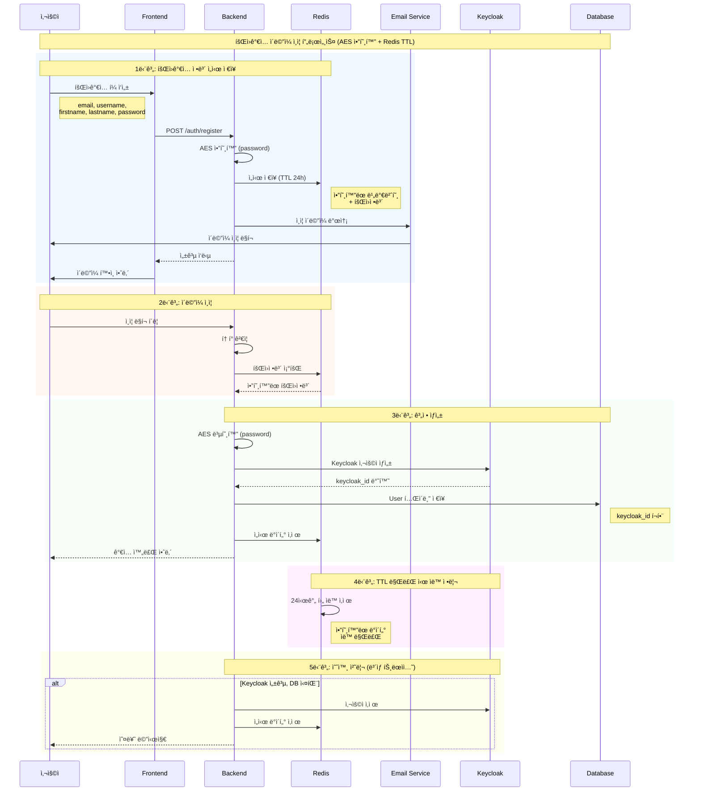
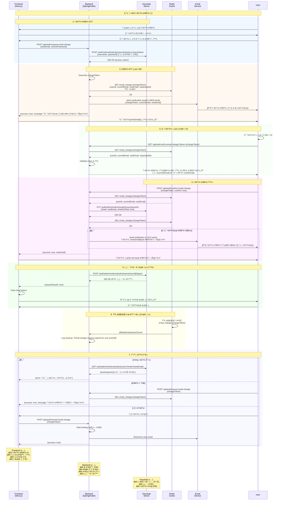

# íšŒì› ê°€ì… ì‹œ ì´ë©”ì¼ ì¸ì¦ (Redis TTL + í† í° ê¸°ë°˜)

```mermaid
sequenceDiagram
    participant User as 사용ì
    participant FE as Frontend
    participant BE as Backend
    participant Redis as Redis
    participant Email as Email Service
    participant KC as Keycloak
    participant DB as Database

    Note over User,DB: 회ì›ê°€ì… ì´ë©”ì¼ ì¸ì¦ 프로세스 (AES 암호화 + Redis TTL)

    rect rgb(240, 248, 255)
    Note over User,Redis: 1단계: 회ì›ê°€ì… ì •ë³´ ì„ì‹œ ì €ì¥
    User->>FE: 회ì›ê°€ì… í¼ ì‘성
    Note right of User: email, username,<br/>firstname, lastname, password
    FE->>BE: POST /auth/register
    BE->>BE: AES 암호화 (password)
    BE->>Redis: ì„ì‹œ ì €ì¥ (TTL 24h)
    Note right of Redis: ì•”í˜¸í™”ëœ ë¹„ë°€ë²ˆí˜¸<br/>+ 회ì›ì •ë³´
    BE->>Email: ì¸ì¦ ì´ë©”ì¼ ë°œì†¡
    Email->>User: ì´ë©”ì¼ ì¸ì¦ ë§í¬
    BE-->>FE: 성공 ì‘답
    FE->>User: ì´ë©”ì¼ í™•ì¸ ì•ˆë‚´
    end

    rect rgb(255, 248, 240)
    Note over User,Redis: 2단계: ì´ë©”ì¼ ì¸ì¦
    User->>BE: ì¸ì¦ ë§í¬ í´ë¦­
    BE->>BE: í† í° ê²€ì¦
    BE->>Redis: 회ì›ì •ë³´ 조회
    Redis-->>BE: ì•”í˜¸í™”ëœ íšŒì›ì •ë³´
    end

    rect rgb(248, 255, 248)
    Note over BE,DB: 3단계: 계정 ìƒì„±
    BE->>BE: AES 복호화 (password)
    BE->>KC: Keycloak 사용ì ìƒì„±
    KC-->>BE: keycloak_id 반환
    BE->>DB: User í…Œì´ë¸” ì €ì¥
    Note right of DB: keycloak_id í¬í•¨
    BE->>Redis: ì„ì‹œ ë°ì´í„° ì‚­ì œ
    BE-->>User: ê°€ì… ì™„ë£Œ 안내
    end

    rect rgb(255, 240, 255)
    Note over Redis,KC: 4단계: TTL 만료 ì‹œ ìë™ ì •ë¦¬
    Redis->>Redis: 24시간 후 ìë™ ì‚­ì œ
    Note right of Redis: ì•”í˜¸í™”ëœ ë°ì´í„°<br/>ìë™ ë§Œë£Œ
    end

    rect rgb(255, 255, 240)
    Note over BE,KC: 5단계: 예외 처리 (ë³´ìƒ íŠ¸ëœì­ì…˜)
    alt Keycloak 성공, DB 실패
        BE->>KC: 사용ì ì‚­ì œ
        BE->>Redis: ì„ì‹œ ë°ì´í„° ì‚­ì œ
        BE-->>User: 오류 메시지
    end
    end
```

# 기존 íšŒì› ì´ë©”ì¼ ë³€ê²½ ì¸ì¦

```mermaid
sequenceDiagram
    participant FE as Frontend<br/>(Next.js)
    participant BE as Backend<br/>(Spring/Kotlin)
    participant KC as Keycloak<br/>Server
    participant Redis as Redis<br/>Cache
    participant Email as Email<br/>Service
    participant User as User

    Note over FE,User: 기존 사용ì ì´ë©”ì¼ ë³€ê²½ ì¸ì¦

    rect rgb(240, 248, 255)
    Note over FE,KC: 1. ì´ë©”ì¼ ë³€ê²½ 요청
    User->>FE: 프로필 설정ì—ì„œ ì´ë©”ì¼ ë³€ê²½
    FE->>User: 새 ì´ë©”ì¼ ì£¼ì†Œ ì…ë ¥ í¼
    User->>FE: 새 ì´ë©”ì¼ ì…ë ¥ ë° í˜„ì¬ ë¹„ë°€ë²ˆí˜¸ 확ì¸
    
    FE->>BE: POST /api/auth/request-email-change<br/>{newEmail, currentPassword}
    BE->>KC: POST /auth/realms/{realm}/protocol/openid-connect/token<br/>{username, password} (í˜„ì¬ ë¹„ë°€ë²ˆí˜¸ ê²€ì¦)
    KC-->>BE: 200 OK {access_token}
    end

    rect rgb(255, 248, 240)
    Note over BE,Redis: 2. 변경 요청 ì„ì‹œ ì €ì¥
    BE->>BE: Generate changeToken
    BE->>Redis: SET email_change:{changeToken}<br/>{userId, currentEmail, newEmail, requestedAt}<br/>TTL: 1시간
    Redis-->>BE: OK
    
    BE->>Email: Send verification email to NEW email<br/>{changeToken, currentEmail, newEmail}
    Email->>User: 📧 "ì´ë©”ì¼ ë³€ê²½ ì¸ì¦" (ì‹ ê·œ ì´ë©”ì¼ë¡œ)
    
    BE-->>FE: {success: true, message: "새 ì´ë©”ì¼ë¡œ ì¸ì¦ ë§í¬ë¥¼ 발송했습니다"}
    FE->>User: "새 ì´ë©”ì¼({newEmail})ì„ í™•ì¸í•´ì£¼ì„¸ìš”"
    end

    rect rgb(248, 255, 248)
    Note over User,BE: 3. 새 ì´ë©”ì¼ì—ì„œ ì¸ì¦ ë§í¬ í´ë¦­
    User->>User: 새 ì´ë©”ì¼í•¨ì—ì„œ ì¸ì¦ ë§í¬ í´ë¦­
    User->>BE: GET /api/auth/verify-email-change?token={changeToken}
    
    BE->>Redis: GET email_change:{changeToken}
    Redis-->>BE: {userId, currentEmail, newEmail, requestedAt}
    
    BE->>BE: Validate token & TTL
    BE-->>User: "ì´ë©”ì¼ ë³€ê²½ì„ ì™„ë£Œí•˜ë ¤ë©´ í™•ì¸ ë²„íŠ¼ì„ ëˆŒëŸ¬ì£¼ì„¸ìš”"<br/>현ì¬: {currentEmail} → 새 ì´ë©”ì¼: {newEmail}
    end

    rect rgb(255, 240, 255)
    Note over User,KC: 4. ì´ë©”ì¼ ë³€ê²½ 확정
    User->>BE: POST /api/auth/confirm-email-change<br/>{changeToken, confirm: true}
    
    BE->>Redis: GET email_change:{changeToken}
    Redis-->>BE: {userId, currentEmail, newEmail}
    
    BE->>KC: PUT /auth/admin/realms/{realm}/users/{userId}<br/>{email: newEmail, emailVerified: true}
    KC-->>BE: 200 OK
    
    BE->>Redis: DEL email_change:{changeToken}
    Redis-->>BE: OK
    
    opt 기존 ì´ë©”ì¼ë¡œ 변경 알림
        BE->>Email: Send notification to OLD email<br/>"ì´ë©”ì¼ì´ {newEmail}ë¡œ 변경ë˜ì—ˆìŠµë‹ˆë‹¤"
        Email->>User: 📧 ì´ë©”ì¼ ë³€ê²½ 완료 알림 (기존 ì´ë©”ì¼ë¡œ)
    end
    
    BE-->>FE: {success: true, newEmail}
    FE->>User: "ì´ë©”ì¼ì´ 성공ì ìœ¼ë¡œ 변경ë˜ì—ˆìŠµë‹ˆë‹¤"
    end

    rect rgb(240, 255, 240)
    Note over FE,User: 5. 세션 갱신 ë° ë¡œê·¸ì•„ì›ƒ 처리
    BE->>KC: POST /auth/admin/realms/{realm}/users/{userId}/logout
    KC-->>BE: 200 OK (모든 세션 무효화)
    
    BE-->>FE: {requireReauth: true}
    FE->>FE: Clear local tokens
    FE->>User: "ë³´ì•ˆì„ ìœ„í•´ 다시 로그ì¸í•´ì£¼ì„¸ìš”"
    User->>FE: 새 ì´ë©”ì¼ë¡œ 로그ì¸
    end

    rect rgb(255, 255, 240)
    Note over Redis,BE: 6. TTL 만료 ì‹œ ìë™ ì •ë¦¬ (1시간 후)
    Redis->>Redis: TTL 만료 ì´ë²¤íŠ¸<br/>email_change:{changeToken}
    Redis->>BE: @RedisKeyExpired Event
    BE->>BE: Log cleanup: "Email change request expired for user {userId}"
    end

    rect rgb(248, 248, 255)
    Note over FE,User: 7. 예외 ìƒí™© 처리
    alt 중복 ì´ë©”ì¼ ì²´í¬
        BE->>KC: GET /auth/admin/realms/{realm}/users?email={newEmail}
        KC-->>BE: [{existingUser}] (ì´ë¯¸ ì¡´ì¬í•˜ëŠ” 경우)
        BE-->>FE: {error: "ì´ë¯¸ 사용 ì¤‘ì¸ ì´ë©”ì¼ì…니다"}
    else 변경 취소
        User->>BE: POST /api/auth/cancel-email-change<br/>{changeToken}
        BE->>Redis: DEL email_change:{changeToken}
        BE-->>FE: {success: true, message: "ì´ë©”ì¼ ë³€ê²½ì´ ì·¨ì†Œë˜ì—ˆìŠµë‹ˆë‹¤"}
    else ì¸ì¦ ì¬ë°œì†¡
        User->>FE: "ì¸ì¦ ì´ë©”ì¼ ì¬ë°œì†¡"
        FE->>BE: POST /api/auth/resend-email-change<br/>{changeToken}
        BE->>BE: Rate limiting (5ë¶„ì— 1회)
        BE->>Email: Resend to new email
        BE-->>FE: {success: true}
    end
    end

    Note over FE: Frontend ì±…ì„<br/>• ì´ë©”ì¼ ë³€ê²½ í¼<br/>• í˜„ì¬ ë¹„ë°€ë²ˆí˜¸ 확ì¸<br/>• ì¸ì¦ ìƒíƒœ 안내<br/>• ì¬ë¡œê·¸ì¸ 처리
    Note over BE: Backend ì±…ì„<br/>• 비밀번호 ê²€ì¦<br/>• Redis í† í° ê´€ë¦¬<br/>• 중복 ì´ë©”ì¼ ì²´í¬<br/>• 세션 무효화
    Note over KC: Keycloak ì±…ì„<br/>• 사용ì ì •ë³´ ì—…ë°ì´íŠ¸<br/>• 세션 관리<br/>• ì´ë©”ì¼ ì¤‘ë³µ ê²€ì¦
```