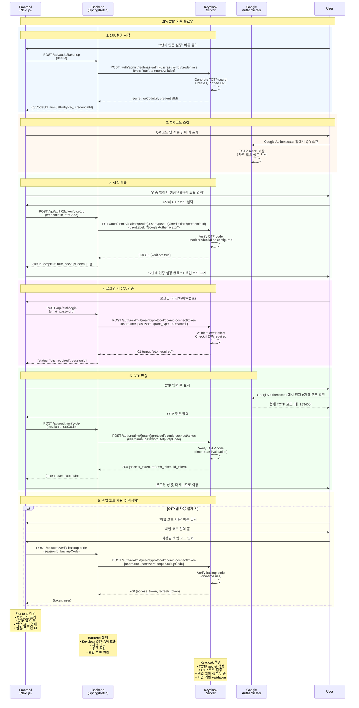

```mermaid
sequenceDiagram
    participant FE as Frontend<br/>(Next.js)
    participant BE as Backend<br/>(Spring/Kotlin)
    participant KC as Keycloak<br/>Server
    participant GA as Google<br/>Authenticator
    participant User as User

    Note over FE,User: 2FA OTP 인증 플로우

    rect rgb(240, 248, 255)
    Note over FE,KC: 1. 2FA 설정 시작
    User->>FE: "2단계 인증 설정" 버튼 클릭
    FE->>BE: POST /api/auth/2fa/setup<br/>{userId}
    BE->>KC: POST /auth/admin/realms/{realm}/users/{userId}/credentials<br/>{type: "otp", temporary: false}
    KC->>KC: Generate TOTP secret<br/>Create QR code URL
    KC-->>BE: {secret, qrCodeUrl, credentialId}
    BE-->>FE: {qrCodeUrl, manualEntryKey, credentialId}
    end

    rect rgb(255, 248, 240)
    Note over FE,User: 2. QR 코드 스캔
    FE->>User: QR 코드 및 수동 입력 키 표시
    User->>GA: Google Authenticator 앱에서 QR 스캔
    GA->>GA: TOTP secret 저장<br/>6자리 코드 생성 시작
    end

    rect rgb(248, 255, 248)
    Note over FE,KC: 3. 설정 검증
    FE->>User: "인증 앱에서 생성된 6자리 코드 입력"
    User->>FE: 6자리 OTP 코드 입력
    FE->>BE: POST /api/auth/2fa/verify-setup<br/>{credentialId, otpCode}
    BE->>KC: PUT /auth/admin/realms/{realm}/users/{userId}/credentials/{credentialId}<br/>{userLabel: "Google Authenticator"}
    KC->>KC: Verify OTP code<br/>Mark credential as configured
    KC-->>BE: 200 OK {verified: true}
    BE-->>FE: {setupComplete: true, backupCodes: [...]}
    FE->>User: "2단계 인증 설정 완료!" + 백업 코드 표시
    end

    rect rgb(255, 240, 255)
    Note over FE,KC: 4. 로그인 시 2FA 인증
    User->>FE: 로그인 (이메일/비밀번호)
    FE->>BE: POST /api/auth/login<br/>{email, password}
    BE->>KC: POST /auth/realms/{realm}/protocol/openid-connect/token<br/>{username, password, grant_type: "password"}
    KC->>KC: Validate credentials<br/>Check if 2FA required
    KC-->>BE: 401 {error: "otp_required"}
    BE-->>FE: {status: "otp_required", sessionId}
    end

    rect rgb(240, 255, 240)
    Note over FE,GA: 5. OTP 인증
    FE->>User: OTP 입력 폼 표시
    User->>GA: Google Authenticator에서 현재 6자리 코드 확인
    GA-->>User: 현재 TOTP 코드 (예: 123456)
    User->>FE: OTP 코드 입력
    
    FE->>BE: POST /api/auth/verify-otp<br/>{sessionId, otpCode}
    BE->>KC: POST /auth/realms/{realm}/protocol/openid-connect/token<br/>{username, password, totp: otpCode}
    KC->>KC: Verify TOTP code<br/>(time-based validation)
    KC-->>BE: 200 {access_token, refresh_token, id_token}
    BE-->>FE: {token, user, expiresIn}
    FE->>User: 로그인 성공, 대시보드로 이동
    end

    rect rgb(255, 255, 240)
    Note over FE,KC: 6. 백업 코드 사용 (선택사항)
    alt OTP 앱 사용 불가 시
        User->>FE: "백업 코드 사용" 버튼 클릭
        FE->>User: 백업 코드 입력 폼
        User->>FE: 저장된 백업 코드 입력
        FE->>BE: POST /api/auth/verify-backup-code<br/>{sessionId, backupCode}
        BE->>KC: POST /auth/realms/{realm}/protocol/openid-connect/token<br/>{username, password, totp: backupCode}
        KC->>KC: Verify backup code<br/>(one-time use)
        KC-->>BE: 200 {access_token, refresh_token}
        BE-->>FE: {token, user}
    end
    end

    Note over FE: Frontend 책임<br/>• QR 코드 표시<br/>• OTP 입력 폼<br/>• 백업 코드 안내<br/>• 설정/로그인 UI
    Note over BE: Backend 책임<br/>• Keycloak OTP API 호출<br/>• 세션 관리<br/>• 토큰 처리<br/>• 백업 코드 관리
    Note over KC: Keycloak 책임<br/>• TOTP secret 생성<br/>• OTP 코드 검증<br/>• 백업 코드 생성/검증<br/>• 시간 기반 validation
```